# KHUB Knowledge Fabric

**A knowledge store that learns from your conversations, persists across sessions and agents, and stays on your machine — inspectable and portable by design.**

**[Knowledge Fabric (KF)](docs/what-is-kf.md)** is the broader runtime knowledge layer in this repository. It wraps one or more LLMs, VLMs, or multimodal models and gives the overall system capabilities the base models do not natively provide on their own: runtime learning, persistent reusable knowledge, explicit revision, and portable human-readable artifacts.

The core learning pattern inside KF is **[PIL (Persistable Interactive Learning)](docs/glossary.md#pil-persistable-interactive-learning)**. PIL is the mechanism by which the system learns from interaction, distils what it learns into persistent [knowledge artifacts](docs/glossary.md#knowledge-artifact), and makes those artifacts available across sessions, tasks, and agents.

## What KF Is In 60 Seconds

- **KF is not a standalone model.** It is a runtime knowledge layer that works with one or more underlying models.
- **KF learns outside the model.** Useful knowledge is captured as persistent artifacts rather than buried in model weights.
- **KF improves systems incrementally.** A correction, rule, procedure, or judgment can change behavior immediately without fine-tuning.
- **KF keeps knowledge governable.** What the system has learned remains inspectable, editable, portable, and auditable.
- **KF goes beyond memory retrieval.** It is about capturing, structuring, applying, revising, and sometimes compiling knowledge into more reliable tools.

If you are new to the project, start with **[What Knowledge Fabric Is](docs/what-is-kf.md)**.

## Inductive learning: a new way to improve AI systems

Knowledge Fabric is built on a simple but far-reaching idea: many of the improvements we want from AI do not require changing the model itself. They require a system that can **learn from interaction**, extract what matters, and keep that knowledge in a form it can reuse.

This is the role of **inductive learning** in KF. Instead of burying improvements inside model weights, KF draws out reusable knowledge from **LLMs, VLMs, and human experts**: rules, procedures, judgments, boundary conditions, and corrective insights. It then turns those into persistent artifacts that can be applied later to patch the weaknesses of the current model in use.

In that sense, KF offers a new path beyond traditional fine-tuning. It improves behavior at the **system layer** rather than the model layer.

That has important consequences:

- **Improvement becomes immediate** — a useful insight can change system behavior without retraining
- **Knowledge stays visible** — what was learned is inspectable, editable, and auditable
- **Knowledge becomes portable** — improvements can move across models, agents, and platforms
- **Expertise becomes cumulative** — human and model-derived insights can compound over time
- **Correction becomes governable** — bad rules can be revised, narrowed, or retired without touching the base model

The long-term implication is significant: instead of treating every model as a largely sealed intelligence that must be retrained to improve, KF treats intelligence as something that can be **continuously extended through explicit, reusable knowledge**.

That is why we see inductive learning as more than a memory feature. It is a candidate for a new layer in the AI stack: one that lets agentic systems become progressively more capable, more aligned to their domains, and more valuable over time without locking those gains inside a vendor model.

## Who this is for

**Agent developers** — if you are building an user-facing agent or AI assistant, PIL gives it a long-term memory that grows with each user interaction. The agent learns patterns, preferences, and workflows naturally from conversation — without requiring the user to say "remember this." Knowledge is stored as lightweight, inspectable artifacts on the user's machine, and applied in future sessions only when confidence warrants it. PIL integrates into any conversation loop, works with any LLM, and is completely platform-agnostic. A complete worked example is available in `apps/computer-assistant/`.

**OpenClaw users** — PIL is packaged as an OpenClaw extension, so your OpenClaw instance can learn the patterns of how you work and become progressively more efficient without you having to repeat yourself. It can also turn a procedure you perform repeatedly into an executable script — future runs become faster, cheaper, and fully reliable.

**Enterprise AI adopters** — deploying AI agents at organizational scale surfaces four problems that no single framing captures:

- **Scalability and cost**: Naive agent memory forces a choice between losing context across sessions or injecting growing conversation histories into every context window — a cost that scales linearly with accumulated history. Structured local artifacts break this: once a preference, convention, or procedure is consolidated, it is applied through an in-memory index lookup at zero LLM cost. The more the system knows, the cheaper each interaction becomes, not the reverse.

- **Knowledge continuity**: When an expert leaves, their judgment — which arguments hold up, which exceptions to flag, which edge cases to handle a particular way — leaves with them. PIL captures that judgment incrementally as active artifacts that a successor's agent inherits from day one, without requiring any explicit documentation effort from the departing employee.

- **Knowledge as an organizational asset**: Structured, versioned, provenance-bearing artifacts are organizational property, not configuration. They survive platform migrations (model-agnostic text, no vendor lock-in), enable coherent M&A knowledge reconciliation at the artifact level, and — as the format matures — can be certified, licensed, or traded as expert knowledge packages.

- **Governance**: Every artifact carries a structured provenance record from creation through retirement — who created it, from which conversation, who approved it for team or org use, when it was revised, and when it was superseded. For regulated industries, this answers the question auditors will eventually ask: *what did the agent know at the time of this recommendation, and who signed off on it?*

**AI ecosystem builders and strategists** — if you are tracking where durable value accumulates in the AI stack, PIL proposes a new asset class: portable, typed, user-owned knowledge artifacts. The artifact format, if it achieves adoption, defines a coordination layer — analogous to what npm did for packages or OpenAPI did for APIs — around which expert knowledge marketplaces, org custody services, and certification businesses can form.

The economic logic is structural, not speculative. Previous attempts at expert knowledge capture — expert systems in the 1980s, knowledge management platforms in the 2000s — failed because experts were asked to invest significant effort in exchange for nothing. PIL changes this in two stages. First and most importantly: the expert gets a better agent for their own work. An investment analyst who elicits their own judgment framework into an agent gets an agent that pre-screens opportunities using their own criteria and applies their standards without being retaught — immediate personal ROI, no marketplace required. Second: that same knowledge package can be distributed or sold, adding further upside once the ecosystem matures.

Think of it as the Excel moment for expert knowledge. Analysts did not build financial models in order to sell them — they built them because they used those models every day to do their own work better. The ability to distribute models was a bonus. PIL works the same way: experts author knowledge packages primarily because a better-trained agent makes them more productive, and distribution is the additional layer that a knowledge marketplace unlocks.

**AI platforms and potential partners** — PIL's default integration is with OpenClaw, but the artifact format and core library are platform-agnostic. A platform that supports PIL artifact import/export gains interoperability with an emerging knowledge ecosystem and a credible story for user data portability and governance.

→ *[Detailed enterprise and investment case](docs/enterprise-vision.md)* · *[Security threat model](docs/security.md)*

## Developer documentation

| Document | What it covers |
|---|---|
| [docs/what-is-kf.md](docs/what-is-kf.md) | **Start here if you are new to the repo.** Quick explanation of what KF is, how it works with LLMs/VLMs, and how it differs from adjacent approaches |
| [docs/ensemble-pipeline.md](docs/ensemble-pipeline.md) | **Start here for development.** 4-round ensemble pipeline, core class APIs (RuleEngine, ToolRegistry, StateManager, GoalManager, call_agent), domain specializations (ARC-AGI-2, ARC-AGI-3, UC200 image classification), extension guide |
| [docs/architecture.md](docs/architecture.md) | Knowledge artifact schema, storage, tiered retrieval, and OpenClaw plugin integration |
| [docs/design-decisions.md](docs/design-decisions.md) | How KF differs from other agent memory systems (Letta, platform memory, fine-tuning) |
| [docs/glossary.md](docs/glossary.md) | Canonical definitions for all KF terms |
| [docs/roadmap.md](docs/roadmap.md) | Planned benchmarks and future use cases |

## Why this exists

If you use an AI agent daily you have likely found yourself re-explaining your preferences, correcting the same mistakes, or re-teaching your workflow every session. The knowledge the agent should have accumulated is simply not there — because most agents today do not have a durable, user-owned place to put it.

The deeper problem: the knowledge AI agents do accumulate — through context windows, compacted session memory, or fine-tuning — remains **server-side, opaque, and platform-locked**. The user cannot inspect, edit, govern, or move it. Switch platforms and it disappears entirely.

PIL takes a different approach: knowledge is extracted from interaction, stored locally as human-readable text, and owned entirely by the user. The artifacts are **model-agnostic** — any sufficiently capable LLM can consume them. They can be edited with a text editor, version-controlled with git, shared with colleagues, or imported into a different AI assistant.

→ *[How this differs from existing agent memory](docs/design-decisions.md#how-this-differs-from-existing-agent-memory)*

## What the agent learns

The project is built around **four types of knowledge**, with emphasis on their generalized forms:

| Memory type | What it captures | Generalized into |
|---|---|---|
| **Episodic** | What happened in conversation | Raw material for generalization of other types |
| **Semantic** | Facts, preferences, conventions | General rules applicable across contexts |
| **Procedural** | How to do things | Structured recipes, optionally executable programs |
| **Evaluative** | What counts as "good" | Judgment heuristics and value frameworks |

**Generalization is the key.** We don't just record that the user corrected a summary format five times — we distill it into a rule ("always use bullet points") that the agent applies proactively in new situations. For procedures, a structured recipe can optionally be compiled into a deterministic program for tasks that require perfect repeatability. For evaluative knowledge, patterns of preference become judgment frameworks the agent uses to make good choices in novel situations — the closest analogue to what we colloquially call "wisdom."

→ *[Full memory taxonomy and evaluative knowledge](docs/memory-taxonomy.md)*

## See it in action

A condensed example of how the agent learns progressively over multiple sessions:

> **Session 2** — Agent notices the user always names financial statements as `YYYY-MM-institution-account.pdf`. It proposes a convention. User confirms. → *Semantic artifact created.*
>
> **Session 3** — Agent learns the user downloads from Chase, Fidelity, and Amex monthly. It proposes a checklist procedure. → *Procedural artifact created.*
>
> **Session 4** — After three identical runs, the agent offers to compile the checklist into a script. → *Recipe retained; executable program linked as optional optimised form.*
>
> **Session 5** — User closes an account and opens a new one. Agent revises the institution list, the procedure, and the script together. → *Coherent revision across artifact types.*

→ *[Full example with dialogue](docs/example-learning-in-action.md)*

## Core idea: Persistable Interactive Learning (PIL)

The system treats dialogue as a learning substrate and produces durable knowledge artifacts through an 8-stage pipeline:

1. **Elicit** — surface candidate knowledge from interaction
2. **Induce** — classify into a typed artifact (semantic, procedural, evaluative, etc.)
3. **Validate** — estimate confidence and scope
4. **Compact** — compress into minimal form; deduplicate
5. **Persist** — store locally with provenance and versioning
6. **Retrieve** — recall by relevance and context
7. **Apply** — confidence-gated: suggest, auto-apply, or hold back
8. **Revise** — update or retire when contradicted or outdated

## Architecture at a glance

```mermaid
graph TB
    subgraph machine["🖥️  Your Machine"]
        subgraph proc["Agent Process"]
            A["Your Agent"] -->|"processMessage · retrieve · apply · revise"| P["PIL Library  (embedded — no daemon needed)"]
        end
        subgraph storage["~/.openclaw/knowledge/  —  plain JSON, user-owned"]
            J["artifacts.jsonl — preferences, rules, procedures, judgments"]
            S["sessions/ — dialogic learning sessions"]
            C["communication-profile.json — dialogue preferences"]
        end
        P -->|"read / write"| J & S & C
    end

    subgraph cloud["☁️  LLM Provider"]
        L["Anthropic · OpenAI · Google · open-source · local"]
    end

    P -->|"extract · consolidate — nothing stored remotely"| L
    L -->|"structured response"| P
```



PIL runs entirely inside your agent process — there is no server, no daemon, and no extra infrastructure to start. Knowledge files are plain JSON on your machine, editable with any text editor. The LLM is called only for processing (extraction, consolidation, response generation) and never stores knowledge on your behalf. Any LLM provider, or a local model, can be substituted by replacing a single adapter function.

## Design goals

- **User-owned and local** — knowledge lives on your machine, not a vendor's server
- **Model-agnostic portability** — artifacts are text; any capable LLM can consume them
- **Platform-agnostic** — works standalone or as an extension; default integration with OpenClaw
- **Confidence-gated reuse** — learned knowledge is *suggested*, *auto-applied*, or *held back* based on certainty
- **Free-form artifacts** — lightweight conventions, not rigid schemas; human-readable and editable
- **Versioned and auditable** — changes are tracked; revisions are first-class

→ *[Design decisions and rationale](docs/design-decisions.md)* · *[Architecture (tiered triggering, knowledge graph, artifact schema)](docs/architecture.md)* · *[Security threat model](docs/security.md)* · *[FAQ](docs/faq.md)*

## Roadmap

### Near-term (Phase 1 milestones)

| Milestone | What it delivers | Status |
|---|---|---|
| **1a — Scaffolding** | Pipeline architecture with placeholder heuristics, playground | ✅ Done |
| **1b — Explicit "remember"** | User says "remember this" → LLM-backed artifact creation → retrieval in future sessions | ✅ Done |
| **1c — Passive elicitation** | Agent observes conversation via hooks and proposes knowledge without explicit instruction | ✅ Done |
| **1d — Tier 1 triggering** | Keyword index enables zero-cost retrieval on every message | ✅ Done |

### Long-term (Phases 2–6)

| Phase | Focus | Status |
|---|---|---|
| **[2 — Generalization Engine](docs/roadmap.md#phase-2--generalization-engine)** | Episodic → semantic/evaluative generalization, Tier 2 triggering, decay, feedback | Planned |
| **[3 — Procedural Memory & Code Synthesis](docs/roadmap.md#phase-3--procedural-memory-and-code-synthesis)** | Structured recipes, optional program compilation, tool library | Planned |
| **[4 — Expert-to-Agent Dialogic Learning](docs/roadmap.md#phase-4--expert-to-agent-dialogic-learning)** | Active expert elicitation through structured dialogue; produces procedures, judgments, boundary conditions, and revision triggers — see [spec](specs/expert-to-agent-dialogic-learning.md) · [demo](docs/demo-dialogic-learning.md) | ✅ Done |
| **[5 — Portability](docs/roadmap.md#phase-5--portability-and-cross-agent-compatibility)** | Standard artifact format, import/export, cross-agent compatibility | Planned |
| **[6 — Governance & Ecosystem](docs/roadmap.md#phase-6--governance-and-ecosystem-long-term)** | Team/org knowledge tiers, access controls, compliance audit trails, knowledge ecosystem and new business models | Long-term |

→ *[Detailed roadmap with milestones](docs/roadmap.md)* · *[Enterprise vision and investment thesis](docs/enterprise-vision.md)*

## Repository structure

```
khub-knowledge-fabric/
├── packages/
│   ├── knowledge-fabric/       # Core PIL library (optional OpenClaw plugin)
│   │   ├── index.ts            # Plugin entry point (when used with OpenClaw)
│   │   ├── openclaw.plugin.json
│   │   └── src/
│   │       ├── pipeline.ts     # Stages 1–4: elicit, induce, validate, compact
│   │       ├── store.ts        # Stages 5–8: persist, retrieve, apply, revise
│   │       └── tools.ts        # knowledge_search tool via OpenClaw plugin SDK
│   └── skills-foo/             # Example PIL-aware skill
│       └── SKILL.md
├── apps/
│   ├── computer-assistant/     # PIL-powered REPL demo (learns from real interaction)
│   │   └── src/
│   └── playground/             # Dev harness — runs the pipeline without OpenClaw
│       └── index.ts
├── tools/
│   └── pil-chat/               # Interactive CLI chatbot for testing PIL
│       └── index.ts
├── specs/                      # Design and mechanism specifications
│   ├── expert-to-agent-dialogic-learning.md            # Spec for learning from experts via dialogue
│   ├── expert-to-agent-dialogic-learning-example-investing.md  # Worked example (investing domain)
│   └── learnable-procedural-primitives-runtime.md      # Spec for LLM-centered procedural learning runtime
└── docs/                       # Design documents
    ├── memory-taxonomy.md      # Four memory types, generalization, cognitive mechanisms
    ├── architecture.md         # Tiered triggering, knowledge graph, artifact schema
    ├── example-learning-in-action.md
    ├── roadmap.md              # Phased roadmap with near-term milestones
    ├── design-decisions.md     # Rationale, differentiators, forward-compatibility
    ├── security.md             # Threat model, risks, and mitigations by phase
    ├── enterprise-vision.md    # Scalability, institutional knowledge, tradeable artifacts, governance, investment thesis
    ├── faq.md                  # Frequently asked questions
    ├── glossary.md             # Definitions for all key terms used across the project
    ├── dialogic-learning-positioning.md  # Landscape comparison: expert-to-agent dialogic learning
    ├── positioning-doc.md      # AI-assisted strategic positioning analysis
    ├── openclaw-plugin-setup.md # Installing and running PIL inside OpenClaw
    └── benchmarks/             # Annotated walkthroughs of runnable test programs
```

## Getting started

**Prerequisites:** Node.js ≥ 18, pnpm, and an Anthropic API key.

The reference implementation uses [Anthropic Claude](https://console.anthropic.com/) as the LLM backend. Any LLM can be substituted by providing a different `LLMFn` adapter — see [`apps/playground/index.ts`](apps/playground/index.ts) for the adapter pattern.

```bash
git clone https://github.com/khub-ai/khub-knowledge-fabric
cd khub-knowledge-fabric
pnpm install

# Set your Anthropic API key (obtain from https://console.anthropic.com/)
export ANTHROPIC_API_KEY=sk-ant-...        # macOS / Linux / WSL
# $env:ANTHROPIC_API_KEY="sk-ant-..."     # Windows PowerShell

pnpm start        # runs all 8 PIL stages against sample input
pnpm dev          # re-runs on file changes (watch mode)
pnpm test         # runs the full test suite (no API key required)
pnpm chat         # interactive PIL chatbot (see tools/pil-chat/)
pnpm chat -- --fresh   # start with a clean store

# Teach the agent something via structured dialogue (Phase 4):
# /teach <domain> "<what to learn>"
# Then answer the agent's follow-up questions until the rule is synthesised.
```

Artifacts are stored at `~/.openclaw/knowledge/artifacts.jsonl`.
Override with `KNOWLEDGE_STORE_PATH=/your/path pnpm start`.

> **Windows PowerShell users:** if `pnpm` fails with a script execution policy
> error (`npm.ps1 cannot be loaded ... not digitally signed`), run this once to
> allow locally-installed package manager scripts:
> ```powershell
> Set-ExecutionPolicy -ExecutionPolicy RemoteSigned -Scope CurrentUser
> ```
> Alternatively, bypass pnpm entirely and run pil-chat directly with Node:
> ```powershell
> node --loader ts-node/esm/transpile-only --no-warnings tools/pil-chat/index.ts -- --fresh
> ```

To run the library as a plugin inside a live OpenClaw instance, see **[docs/openclaw-plugin-setup.md](docs/openclaw-plugin-setup.md)**.

## Implementation status

Phases 1 and 4 are implemented. The passive learning pipeline (1a–1d) and the dialogic learning engine (Phase 4) are both functional.

### What's implemented

| Component | Module | Status |
|---|---|---|
| **Artifact schema** | `src/types.ts` | Full schema: kind, certainty, scope, stage, tags, evidence, relations, salience, lifecycle fields |
| **LLM extraction** | `src/extract.ts` | `extractFromMessage()` — language-agnostic, single LLM call per message |
| **Evidence consolidation** | `src/extract.ts` | `consolidateEvidence()` — distills N observations into a generalized rule |
| **Pipeline orchestration** | `src/pipeline.ts` | `processMessage()` — extract → match → accumulate → inject decision |
| **Three-stage model** | `src/store.ts` | candidate → accumulating → consolidated; auto-promotes at threshold (default: 3) |
| **Tag-based retrieval** | `src/store.ts` | `retrieve()` — tag overlap scoring (Tier 1) + content fallback |
| **Inject label logic** | `src/store.ts` | `[established]` / `[suggestion]` / `[provisional]` gating |
| **Feedback tracking** | `src/store.ts` | `recordAccepted()` / `recordRejected()` — nudge confidence from user signals |
| **Plugin wiring** | `index.ts` / `src/hooks.ts` / `tools.ts` | `knowledge_search` tool registered; `message_received` + `before_prompt_build` hooks implemented (Milestones 1c/1d) |
| **Computer-assistant demo** | `apps/computer-assistant/` | REPL, Anthropic LLM adapter, OS actions, PIL-aware agent |
| **Test suite** | `apps/computer-assistant/src/tests/` | 112 tests covering extraction, store, pipeline, scenarios, and benchmarks |
| **Benchmark suite** | `apps/computer-assistant/benchmarks/` | Extraction precision/recall/F1; retrieval hit rate; 18+ scenarios |
| **Session management** | `src/session.ts` | `createSession`, `loadSession`, `saveSession`, `listSessionsByDomain`, `promoteSession` (idempotent) |
| **Dialogic engine** | `src/dialogue.ts` | Gap-driven question ladder, LLM synthesis, correction parsing, `processTurn` entrypoint |
| **pil-chat teach mode** | `tools/pil-chat/index.ts` | `/teach <domain> "<objective>"`, gap-status bar, `/endteach`; see [demo walkthrough](docs/demo-dialogic-learning.md) |

### Phases 1 and 4 complete ✅

**Phase 1** — passive learning: knowledge is extracted from every inbound message, accumulated across interactions, consolidated into generalized rules, and injected into future prompts automatically via the `before_prompt_build` hook.

**Phase 4** — dialogic learning: the expert runs `/teach <domain> "<objective>"` in pil-chat. The agent asks five targeted follow-up questions (one per consolidation gap), proposes a synthesis when all gaps are closed, parses the expert's correction, and promotes the confirmed rule to `artifacts.jsonl` with session provenance. A subsequent session in the same domain retrieves and injects the rule automatically. See the [full demo walkthrough](docs/demo-dialogic-learning.md).

### Phases 2, 3, 5, 6 — planned

- True Tier-2 triggering: cheap LLM disambiguation of partial tag matches
- Decay: effective confidence decreases for unretrieved, unreinforced artifacts
- Semantic/vector retrieval
- Evaluative knowledge generalization (judgment heuristics, value frameworks)
- Procedural recipe compilation to executable programs ([Phase 3](docs/roadmap.md#phase-3--procedural-memory-and-code-synthesis))
- Import/export and cross-platform portability ([Phase 5](docs/roadmap.md#phase-5--portability-and-cross-agent-compatibility))
- CLI for inspecting, editing, and deleting artifacts

## Non-goals

- Not fine-tuning base LLM weights
- Not a replacement for any specific AI platform — this is a portable knowledge layer
- Not treating "memory" as a single bucket — knowledge types differ and require different controls
- Not prescribing a rigid schema — artifacts are free-form text with conventions

## Status

Phases 1 and 4 implemented. Passive learning (Milestones 1a–1d) extracts knowledge from user messages, accumulates evidence across interactions, and injects consolidated rules into future prompts automatically. Phase 4 adds active expert elicitation via `/teach` in pil-chat — the agent asks targeted follow-up questions, synthesises a rule when all five consolidation gaps are closed, and promotes it to the knowledge store with full session provenance. 112 tests pass with no API key required.

## License

KHUB Knowledge Fabric is released under the **[PolyForm Noncommercial License 1.0.0](LICENSE)**.

- Noncommercial use is permitted, including personal use, research, education, government, and other noncommercial organizational use.
- The repo is **source-available**, not open-source.
- Commercial use requires a separate commercial license.

If you are evaluating KHUB Knowledge Fabric for a potential commercial deployment, keep that distinction in mind before redistributing, bundling, or offering it as part of a paid product or service.

## Contributing

Contributions are welcome — especially around:
- Knowledge artifact conventions and evaluation
- Retrieval and ranking methods for learned artifacts
- Evaluative knowledge representation
- Procedural knowledge and code synthesis
- Safe application policies and conflict resolution
- Tooling for inspection, export, and deletion

---

**Working thesis:** Agents become genuinely useful when they can **learn interactively**, **persist what they learn as user-owned artifacts**, and **reliably reuse that knowledge** — all without repeatedly re-prompting the user, retraining the model, or locking knowledge into a vendor's platform.
