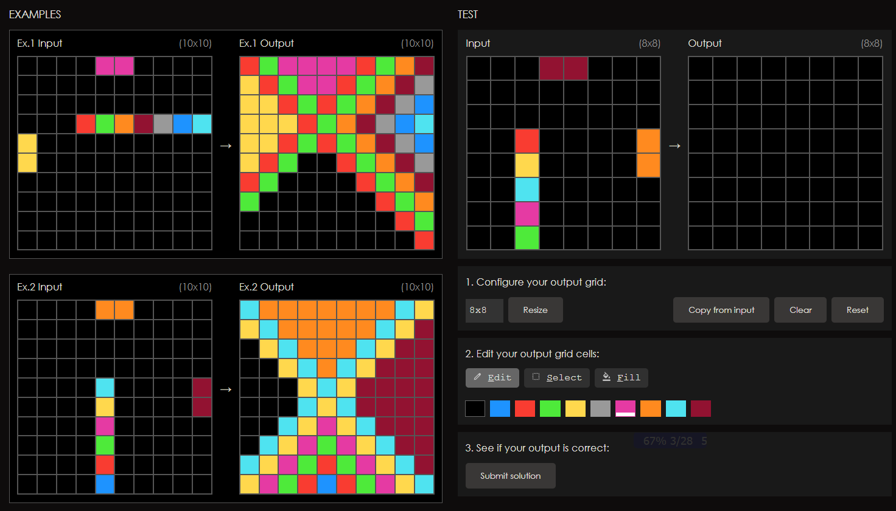

# Knowledge Fabric in Action: How an AI System Learns, Accumulates, and Applies Generalized Knowledge

**Knowledge Fabric (KF)** is a framework for building AI systems that accumulate generalized knowledge — in the form of rules and executable tools — as they solve tasks, and apply that knowledge to solve future tasks more reliably and at lower cost. Unlike systems that rely on retrieval or weight updates, KF externalizes what it learns into an inspectable, auditable, locally-owned knowledge base that grows more capable with every task it completes.

*What follows describes a specialized instantiation of KF applied to solving ARC-AGI puzzles. The core KF principles are fully in place here; we intend to apply the same architecture to other domains in the near future.*

---

## ARC-AGI: The Proving Ground

[ARC-AGI](https://arcprize.org/) (Abstraction and Reasoning Corpus for Artificial General Intelligence) is a benchmark designed to test genuine abstract reasoning — the kind that cannot be solved by memorization or pattern-matching on surface features. Each puzzle presents a small number of input/output training pairs (typically 2–5), where each pair shows a colored grid before and after some transformation. The system must infer the transformation rule from those examples alone and apply it correctly to a new input it has never seen.


*Task [1190bc91](https://arcprize.org/tasks/1190bc91) on the ARC Prize playground. The left panel shows two training pairs (input → output). The right panel shows the test input; the system must produce the correct output grid.*

The benchmark is deliberately resistant to lookup and interpolation. Two puzzles that look visually similar can have entirely different rules. This makes ARC-AGI an ideal proving ground for Knowledge Fabric: success requires genuine generalization from a handful of examples, which is precisely what KF is built to do.

---

## Context: How AI Systems Retain Knowledge Today

Before describing what Knowledge Fabric does, it is worth situating it against the current landscape. Most AI systems handle knowledge retention in one of the following ways:

| Approach | How knowledge is "retained" |
|---|---|
| RAG | Retrieves documents — abstraction is limited to chunk selection, not rule extraction |
| Fine-tuning | Updates weights — knowledge is implicit in parameters, not inspectable or provenance-tracked |
| Memory systems (MemGPT, etc.) | Stores facts and conversation summaries — generalization across tasks is not the design goal |
| Tool use (function calling) | Operates on pre-defined tools — dynamic tool generation from task evidence is not standard practice |
| o1/o3 reasoning | Deep per-task reasoning — accumulated cross-task knowledge is not part of the architecture |

None of these approaches is wrong for its intended purpose. The point is that none of them is designed to do what Knowledge Fabric does: extract abstract, generalizable rules from task experience, generate and verify executable tools, and accumulate both in a local, auditable knowledge base that compounds in value over time.

---

## The Core Mechanism

Knowledge Fabric's engine is a **multi-agent inference loop** built around four components, each with a distinct role. Three are always active; a fourth is invoked on demand.

- **SOLVER** — proposes a hypothesis describing the transformation rule
- **MEDIATOR** — verifies the hypothesis and translates it into an execution plan
- **EXECUTOR** — runs the plan deterministically and checks the result
- **Tool Generator** — called by MEDIATOR when a required capability does not yet exist

These components run in sequence: SOLVER proposes, MEDIATOR verifies and plans, EXECUTOR applies. If EXECUTOR fails, MEDIATOR revises and the loop repeats. Before any of this runs, a preliminary **Round 0** checks the accumulated rule registry — if a prior rule matches the current task's pattern, the system can bypass SOLVER entirely and go straight to execution.

### The Agents in Detail

**SOLVER** is the hypothesis engine. Given a task — a set of input/output training pairs (small grids of colored cells, each pair showing a before and after state) — SOLVER reasons simultaneously across three dimensions: spatial structure, procedural transformation, and analogical pattern. It produces a single, falsifiable hypothesis: a precise natural-language description of the rule governing the transformation.

**MEDIATOR** is the verifier and orchestrator. It takes SOLVER's hypothesis and rigorously tests it mentally against every training pair. If the hypothesis holds, MEDIATOR translates it into deterministic pseudo-code — a structured JSON execution plan specifying which tools to call and in what order. If the plan requires a capability that does not yet exist in the tool registry, MEDIATOR issues a **tool generation request**, specifying the required behavior with concrete input/output examples drawn directly from the training pairs.

**EXECUTOR** runs the pseudo-code against the test input deterministically using the registered tool library. No LLM inference happens at execution time. The answer is either correct or it isn't.

**Tool Generator** receives MEDIATOR's specification and generates a Python function. It immediately tests the generated code against all training pairs and self-corrects on failure, up to three attempts. Only code that passes every training pair is registered. Code that cannot pass is discarded.

### Failure: The Self-Correction Loop

When EXECUTOR produces a wrong answer, the system does not simply retry. MEDIATOR receives the failed output, diagnoses the gap between what the hypothesis predicted and what actually happened, and issues a **revised pseudo-code plan**. This revision loop runs up to five cycles (the "revision budget") before the task is marked as failed and escalated. Each revision is a targeted correction, not a random retry. If a tool is found to be wrong, MEDIATOR can request a corrected tool, which re-enters the Tool Generator's verification loop independently.

### Success: Generalizing Knowledge

When a task is solved, the learning does not stop. MEDIATOR extracts the governing rule and writes it to a **persistent rule registry**. Rules are expressed in **plain natural language** — structured, categorized, and immediately readable by a human. Tools are stored as **verified Python functions**. This distinction is deliberate: natural language rules are easy to inspect, audit, and generalize; Python tools provide the deterministic precision that LLMs cannot.

Rules are not written as solutions to specific tasks — they describe a *class* of patterns, applicable to future tasks that share the same underlying structure even if surface details differ. New rules enter at `candidate` status and are promoted to `active` only after firing successfully on a task different from the one that created them. Every rule carries full **lineage** — whether it was created fresh, generalized, specialized, merged, or consolidated from prior rules — making the knowledge base auditable and traceable over time.

The registry actively maintains its own quality. An **auto-deprecation mechanism** monitors rule performance: any rule that fires repeatedly but never contributes to a correct solution is automatically retired. The knowledge base stays lean and accurate over time.

> **A note on data ownership**: the rules and tools accumulated by this process are stored entirely on the user's local machine. No knowledge is sent to an external service or shared across users. This design is intentional — it enables user ownership, clear provenance of how each piece of knowledge was derived, and governance over what the system knows and applies. In regulated industries this is not a convenience; it is a requirement.

---

## What a Rule Looks Like

Rules are stored as structured natural language entries. Here is a real rule extracted after solving an ARC-AGI puzzle involving gravity-like object sorting:

```
Condition: [gravity] Grid contains multiple disconnected objects classifiable as either
           (a) closed hollow rectangles (complete rectangular perimeter with all interior
           cells background, bounding box at least 3×3) or
           (b) open/cross shapes (plus, T, L, asymmetric cross, incomplete frame,
           or any non-rectangular outline)

Action: Move all CLOSED HOLLOW RECTANGLES to TOP of grid stacking from row 0 downward;
        move all OPEN/CROSS shapes to BOTTOM stacking from last row upward. Each object
        slides as a rigid unit preserving its exact column span and its original color.
        Different-type objects pass through each other freely; same-type objects maintain
        original relative vertical order. Use gravity_by_type tool.
        Classification is purely structural/geometric, not color-based.

Lineage: consolidated (merged from 8 near-duplicate rules describing the same pattern)
Status: active | Fired: 6 | Succeeded: 2 | Failed: 4
```

An AI practitioner will notice several things here: the rule is not a specific puzzle solution — it describes a *class* of spatial sorting problems. The lineage shows the system evolved this rule by consolidating eight narrower rules that had accumulated across multiple puzzles. The success/failure stats show the rule is imperfect and will be auto-deprecated if it continues to underperform — the knowledge base is self-correcting.

---

## What a Tool Looks Like

Tools are Python functions generated by the system, verified against training pairs, and registered for deterministic reuse. Here is `fill_enclosed` — generated to handle a class of puzzles requiring enclosed-region detection:

```python
def fill_enclosed(grid, **kwargs):
    """Flood-fill from all border background cells;
    any background cell not reachable becomes fill_color."""
    from collections import deque
    background = kwargs.get('background', 0)
    fill_color  = kwargs.get('fill_color', 4)
    H, W = len(grid), len(grid[0])
    result   = [row[:] for row in grid]
    visited  = [[False] * W for _ in range(H)]
    queue    = deque()
    # Seed BFS from every background cell on the border
    for r in range(H):
        for c in range(W):
            if (r == 0 or r == H-1 or c == 0 or c == W-1) and grid[r][c] == background:
                visited[r][c] = True
                queue.append((r, c))
    while queue:
        r, c = queue.popleft()
        for dr, dc in [(-1,0),(1,0),(0,-1),(0,1)]:
            nr, nc = r+dr, c+dc
            if 0<=nr<H and 0<=nc<W and not visited[nr][nc] and grid[nr][nc]==background:
                visited[nr][nc] = True
                queue.append((nr, nc))
    # Any background cell not reached from the border is enclosed
    for r in range(H):
        for c in range(W):
            if grid[r][c] == background and not visited[r][c]:
                result[r][c] = fill_color
    return result
```

This tool was generated autonomously — the system wrote it, tested it against every training pair, and registered it only after it produced exact matches on all training pairs. Once registered, it is available to any future task that involves enclosed regions, at zero additional LLM cost.

### Why Tools Matter Beyond Convenience

The creation of tools is not a workflow optimization — it addresses a fundamental limitation of LLMs. Language models are poor at tasks requiring **repetitive precision**: counting cells, tracking coordinates across a large grid, applying the same geometric operation consistently to dozens of objects. A single off-by-one error in a 30×30 grid produces a wrong answer even when the reasoning was correct.

Deterministic Python tools eliminate this failure mode entirely. Once `fill_enclosed` exists and is verified, it produces the exact same output every time, on any input, with zero probability of a counting error. This has two direct consequences:

- **Reliability**: tasks that previously failed due to execution errors now pass consistently. The system's accuracy ceiling rises as the tool library grows.
- **Cost**: tool execution has no LLM inference cost. A task solved via Round 0 rule match plus a registered tool costs a fraction of a task requiring full hypothesis generation. As the registry fills, average cost per task drops measurably.

---

## Case Study: Task 1190bc91

Task [1190bc91](https://arcprize.org/tasks/1190bc91) illustrates the full Knowledge Fabric cycle — including failure, diagnosis, human insight, and structural repair — in a single concrete example.

The puzzle (shown in the screenshot above) presents two or three sparse linear sequences of colored cells on a black background. The output fills the entire grid according to a rule that, once understood, is elegant: the **longest sequence** acts as a spine, with each of its cells radiating its color outward along all four diagonal directions, tip-to-tail, stopping when it hits a filled cell or the grid boundary. The **shorter sequences** then flood-fill outward in all eight directions, naturally staying confined to whatever regions the spine's radiation left unfilled. The critical insight is that these two roles are asymmetric — the spine must complete its radiation before the shorter sequences touch anything.

The system failed this task three times in a row. In the first attempt, SOLVER correctly noticed diagonal radiation but assumed all sequences transform identically — missing the asymmetry entirely. MEDIATOR, finding no tool for "diagonal radiation for all sequences uniformly," stalled and produced zero execution steps, an automatic failure. In the second attempt, after fixing the stall, MEDIATOR requested a new tool called `radiate_sequences` with a monolithic spec. The Tool Generator iterated through all five allowed attempts and failed every time — not because the code was badly written, but because the spec itself was wrong: without knowing that spine and peripherals are conceptually different operations, every generated variant applied the same algorithm to everything and got visually plausible but numerically incorrect results. In the third attempt, SOLVER proposed a Chebyshev-distance radiation hypothesis that reached 68% cell accuracy — close enough to look promising, but wrong — and the revision budget ran out.

At this point the human provided a single sentence of insight: *"You need to identify the longest sequence and do the radiation step. For the rest, just propagate them out in all directions until blocked."* One follow-up clarified the order: *"The long sequence has priority — do it first, starting from the tip, one cell at a time."* That was the entirety of the human's contribution. Claude Code (Anthropic's AI-powered development environment) translated this into three targeted system upgrades: a verified two-phase Python builtin (`radiate_sequences`) added to the tool library; a prompt addition to SOLVER explicitly asking whether all groups play the same role or different roles; and a new rule (`r_102`) encoding the structural fingerprint of this puzzle class so future similar puzzles bypass the solver entirely via Round 0 matching.

The task was then rerun with no hints. The result:

```
Round 0: matching rules... Matched 1 rule(s): ['r_102']
Round 2: MEDIATOR: Step 1: radiate_sequences({'background': 0})
Round 3: EXECUTOR: All demos passed.
✓ CORRECT | 100.0% | 44.2s | $0.17
```

| | Failed attempt | After repair |
|---|---|---|
| Time | 585 seconds | 44 seconds |
| Cost | $0.91 | $0.17 |
| Outcome | Fail | Correct (100%) |

The system never needed the human's insight again. Any future puzzle with a similar structure — linear sequences where the longest dominates and the shorter ones fill remaining space — will be recognized in Round 0 and solved directly. One human sentence became a permanent capability.

---

## Claude Code as Development Manager

This is where Knowledge Fabric diverges most sharply from conventional AI development — and where an honest assessment is warranted.

When the multi-agent loop exhausts its revision budget and fails, Claude Code (Anthropic's AI-powered development environment) analyzes the failure, categorizes the gap — whether it lies in the hypothesis strategy, the tool library, the execution logic, or the rule representation — and proposes a targeted system-level change: not a workaround, but a structural improvement to the system itself. It then reruns the system with no hints and no task-specific shortcuts to confirm the fix produces a correct solution autonomously.

A critical discipline governs this process: **gap repair must never become answer injection**. The distinction is concrete: adding a new built-in tool or a new reasoning step to the solver prompt is gap repair — any future puzzle can benefit from it. Pre-seeding the specific answer for the failing task — telling the system which rule applies, or what the output should be — is answer injection. Answer injection produces a one-time fix that transfers nothing. Gap repair permanently expands the class of problems the system can solve on its own.

When Claude Code cannot close the gap, it surfaces a precise question to the human: not "what is the answer?" but "what is the missing insight?" The human responds with a minimal hint — as illustrated in the 1190bc91 case study above, sometimes a single sentence. Claude Code then translates that hint into a concrete system upgrade and reruns the task end-to-end to verify it.

### Is This a Unique Way to Do AI?

Honestly: **the individual components are not new. The discipline and the specific recursive structure are.**

Every senior software engineer diagnoses failures, proposes fixes, and validates them. What Claude Code does in this system is structurally the same — it is just that the "engineer" is itself an LLM operating on an LLM-powered system. The recursion is interesting but not without precedent; self-improving AI systems have been explored in various forms.

What is **genuinely notable** here is threefold:

1. **The gap repair discipline is formalized and enforced**, not left to developer judgment. The distinction between gap repair and answer injection is precise, documented, and treated as a correctness criterion. Most development teams, human or AI-assisted, do not apply this discipline rigorously. They patch the immediate failure. The result is a system that accumulates workarounds rather than capabilities.

2. **The human's role is explicitly minimized and bounded**. The system is designed so that Claude Code exhausts its own diagnostic capacity before escalating. When escalation happens, the human provides the minimum viable insight — not the solution. This is different from conventional HITL (Human-in-the-Loop) systems where the human is a routine participant. Here the human is an expert consultant called only when the system's own reasoning reaches its limit.

3. **The improvement target is the AI system's generalization capacity, not its task performance**. When Claude Code adds a reasoning step to the solver prompt or adds a built-in tool, it is not solving the current puzzle — it is expanding the class of puzzles the system can solve autonomously in the future. This orientation toward structural generalization rather than local correctness is what distinguishes the process.

The fair claim is this: Claude Code is not just a coding assistant here; it is a principled methodology for continuous structural improvement of an AI system, applied recursively. That is significant, even if none of the individual components are unprecedented.

---

## Benefits and Application Domains

### Why This Architecture Matters

| Property | Benefit |
|---|---|
| Create generalized knowledge artifacts | Rules and tools are created dynamically as the system solves problems, then persisted — each one a reusable asset that reduces the cost and increases the reliability of every future similar task |
| Rules in natural language | Auditable, explainable, editable by domain experts without engineering involvement |
| Tools in verified Python | Exact, deterministic execution; eliminates the precision errors that LLMs are prone to on repetitive or computational tasks |
| Local storage | User owns all accumulated knowledge; full provenance; no vendor dependency |
| Auto-deprecation | Knowledge base stays accurate over time; underperforming rules are retired automatically |
| Rule lineage | Every piece of knowledge traces back to the task and correction event that created it |
| Cost compounding | Each solved task reduces average cost for all future similar tasks |

### Domains That Benefit Most

Knowledge Fabric's architecture delivers the greatest value in domains where:
- Tasks share underlying structural patterns across many instances
- Correct answers are verifiable (there is a ground truth)
- Precision matters — where an off-by-one error or a missed edge case is a wrong answer
- Knowledge ownership and auditability are requirements, not preferences

**Strongest candidates:**

**Medical diagnosis and clinical decision support** — diagnostic rules generalize across patients; tools can compute lab value thresholds, risk scores, and differential rankings with exactness that prose LLM responses cannot guarantee. Provenance of each rule (which cases informed it) is a regulatory requirement.

**Legal reasoning and contract analysis** — legal rules are inherently structured as condition-action pairs; tools can extract clause patterns, compute obligation timelines, and flag conflicts deterministically. Firm-specific rule bases stay local and proprietary.

**Financial analysis and risk assessment** — quantitative rules generalize across assets and time periods; tools eliminate the arithmetic errors that LLMs make on multi-step calculations. Audit trails are mandatory.

**Scientific research and experiment design** — hypotheses about experimental patterns can be formalized as rules; tools can apply statistical tests, normalize data, and detect anomalies with precision. Reproducibility requires deterministic execution.

**Manufacturing and quality control** — inspection rules generalize across product variants; tools apply geometric and statistical checks that require exact computation. Local storage keeps proprietary process knowledge off external servers.

**Software engineering and code review** — code patterns generalize across codebases; tools can run static analysis, compute complexity metrics, and detect anti-patterns deterministically. Rule bases accumulate institutional knowledge that currently lives only in senior engineers' heads.

The common thread: **any domain where expertise can be expressed as generalizable rules, where execution requires precision, and where the knowledge has enough value to be worth owning.**
