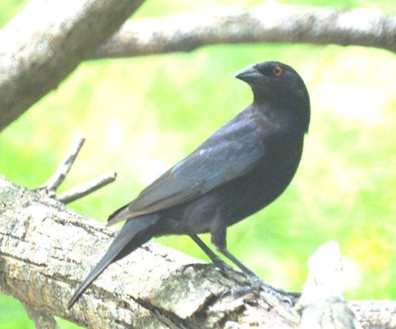
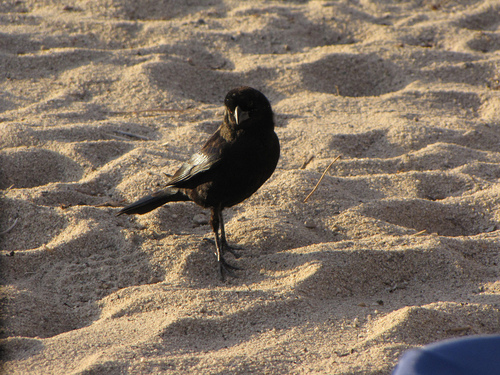
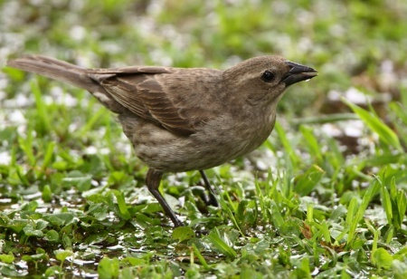

# Knowledge Fabric for Bird Species Identification

> **For**: Ornithologists, naturalists, and field biologists curious about how AI can be corrected by domain experts without any programming or retraining.
>
> **Status**: Three experiments completed. First: GPT-4o, single-pass rule injection. Second: Claude Sonnet 4.6, full KF ensemble pipeline with structured observation layer. Third: Qwen3-VL-8B pupil + Claude Sonnet 4.6 expert, full KF dialogic patching loop — 33%→67% on Bronzed/Shiny Cowbird.
>
> **Dataset**: CUB-200-2011, 200 North American bird species, 11,788 images.
>
> **Also see**: [Image Classification Overview](../README.md) for the broader Knowledge Fabric context, including the dermatology use case and cross-domain comparisons.

---

## The One-Line Summary

An AI model was confused by pairs of visually similar bird species. An ornithologist explained, in plain language, the field marks that distinguish them. The system turned those explanations into explicit rules and applied them — improving accuracy on the targeted pairs, without retraining the model.

---

## Contents

1. [Why Birds](#1-why-birds)
2. [The Dataset](#2-the-dataset)
3. [The Approach](#3-the-approach)
4. [Experiment 1 — Single-Pass Rule Injection (GPT-4o)](#4-experiment-1--single-pass-rule-injection-gpt-4o)
5. [Experiment 2 — KF Ensemble with Structured Observation (Claude Sonnet 4.6)](#5-experiment-2--kf-ensemble-with-structured-observation-claude-sonnet-46)
6. [Experiment 3 — KF Dialogic Patching Loop (Qwen3-VL-8B + Claude Sonnet 4.6)](#6-experiment-3--kf-dialogic-patching-loop-qwen3-vl-8b--claude-sonnet-46)
7. [What This Shows About Expert Knowledge Patching](#7-what-this-shows-about-expert-knowledge-patching)

---

## 1. Why Birds

Fine-grained visual classification of bird species is an ideal proving ground for the Knowledge Fabric thesis — that a domain expert's natural-language explanations can improve AI accuracy on hard cases without retraining.

**The gap is large and measurable.** CLIP zero-shot performance on CUB-200 is around 65%. The supervised state of the art (HERBS, 2023) reaches 93%. That 28-percentage-point gap represents exactly the space where expert discriminative knowledge matters — and where KF aims to operate.

**The hard cases are well-defined.** The remaining errors at SOTA are concentrated in confusable species pairs: Downy vs Hairy Woodpecker, Herring vs Thayer's Gull, Orchard vs Baltimore Oriole. These are exactly the cases where expert verbal criteria ("the bill is shorter relative to head size in a Downy") matter most and where statistical training on aggregate visual features falls short.

**Expert language is publicly available.** Field guides (Sibley, Kaufman), eBird species accounts, and ornithological literature contain precisely the discriminative reasoning KF needs — for every species and every confusable pair. No live ornithologist was required for this experiment; well-documented published expertise substituted.

**The logic is transparent.** "This is a Hairy Woodpecker rather than a Downy because the bill is as long as the head depth, not shorter" is a sentence any naturalist can read, understand, and verify. The knowledge is explicit and auditable.

---

## 2. The Dataset

**CUB-200-2011** (Caltech-UCSD Birds)

| Property | Value |
|---|---|
| Images | 11,788 (5,994 train / 5,794 test) |
| Classes | 200 North American bird species |
| Annotations | Labels + 312 binary visual attribute annotations + 10 per-image natural language descriptions (Reed et al.) |
| Access | Fully open — [Caltech download](https://data.caltech.edu/records/65de6-vp158) |
| Leaderboard | [Papers with Code](https://paperswithcode.com/sota/fine-grained-image-classification-on-cub-200) |
| CLIP zero-shot | ~65% |
| Supervised SOTA | 93.1% (HERBS, 2023) |

The 312 binary attribute annotations are the closest analogue in ornithology to the lesion-attribute annotations in dermatology: structured visual criteria, defined per species, that capture exactly the kind of discriminative field knowledge KF is designed to work with.

---

## 3. The Approach

The experiment was designed to answer one narrow, practical question:

> Can a domain expert's natural-language field-mark knowledge improve classification on targeted hard cases — confusable species pairs — without retraining the base model?

Expert knowledge was pre-encoded from published sources: Sibley's Guide, Kaufman's Field Guide, eBird/allaboutbirds.org species accounts, and CUB-200's own attribute annotations. These were formatted as per-pair teaching files and imported into the Knowledge Fabric knowledge base.

In the intended production workflow, an ornithologist would interact with the system in real time — reviewing proposed rule candidates, correcting errors, and confirming what should be kept. The batch import substitutes for that live session. It is a conservative simulation: a live expert would catch errors that batch import lets through.

---

## 4. Experiment 1 — Single-Pass Rule Injection (GPT-4o)

**Setup**: GPT-4o with expert rules injected as plain text into the system prompt. 15 confusable species pairs, 20 images per class per condition (40 per pair).

### Selected pairs

**Pairs where KF helped**

| Red-faced Cormorant | Pelagic Cormorant |
|---|---|
|  |  |

*Red-faced has an orange-red facial skin patch and a yellow-orange bill base. Pelagic is smaller, more slender, with iridescent plumage and a much smaller red facial patch. KF rules correctly steered the model toward the facial patch and bill color.*

| Bronzed Cowbird | Shiny Cowbird |
|---|---|
|  |  |

*Bronzed has a distinctive ruff on the back of the neck and red eyes. Shiny is uniformly iridescent with dark eyes. KF rules for the ruff and eye color improved accuracy by 10 percentage points.*

| Black-billed Cuckoo | Yellow-billed Cuckoo |
|---|---|
|  |  |

*Yellow-billed has a prominent yellow lower mandible and large white tail spots. Black-billed has a darker bill and smaller, less distinct tail spots. KF rules for bill color and tail-spot size improved accuracy by 7 percentage points.*

**Pairs that exposed patch quality or task limit issues**

| American Crow | Fish Crow |
|---|---|
|  |  |

*These two species are nearly identical visually — the main distinction is voice, not appearance. Initial KF rules referenced voice and habitat, which are not observable in an image. A later structured-evidence patch recovered the pair to zero-shot parity by grounding the rule in the few visible cues (relative bill and leg proportions).*

| Chipping Sparrow | Tree Sparrow |
|---|---|
|  |  |

*The patch source text inadvertently described the wrong species for Chipping Sparrow. The rule then biased every prediction in the pair toward the wrong answer. Once corrected, performance recovered from 42% back to 88%. This failure showed that bad rules cause systematic harm, not random noise — and that expert review before accepting rules is not optional.*

| Brewer Sparrow | Clay-colored Sparrow |
|---|---|
|  |  |

*A label-normalization mismatch ("Brewer's Sparrow" vs "Brewer Sparrow") confounded the reported result for this pair. After accounting for that, the pair remains a hard stress test — suggesting that some confusable pairs require the AI to externalize and explicitly report its feature observations before applying rules, rather than relying on prompt injection alone.*

### Summary results — Experiment 1

| Condition | Accuracy |
|---|---|
| Zero-shot | 78.0% |
| Few-shot | 82.8% |
| KF-patched (first run) | 72.5% |
| KF-patched (after patch correction) | 75.5% |

The aggregate numbers understate the real lessons. The pair-level results divide into three distinct stories:

| Pair | Zero-shot | Few-shot | KF-patched | Delta |
|---|---|---|---|---|
| Red-faced vs Pelagic Cormorant | 82% | 95% | 92% | **+10pp** |
| Bronzed vs Shiny Cowbird | 88% | 95% | 98% | **+10pp** |
| Black-billed vs Yellow-billed Cuckoo | 78% | 88% | 85% | **+7pp** |
| California Gull vs Herring Gull | 45% | 40% | 50% | +5pp |
| Caspian Tern vs Elegant Tern | 85% | 92% | 88% | +3pp |
| American Crow vs Fish Crow | 68% | 68% | 68% | 0pp |
| Chipping Sparrow vs Tree Sparrow | 88% | 90% | 88% | 0pp |
| Common Raven vs White-necked Raven | 88% | 92% | 85% | −3pp |
| Loggerhead Shrike vs Great Grey Shrike | 80% | 55% | 72% | −8pp |

**KF helped** on the cormorant, cowbird, and cuckoo pairs because the rules pointed to features that were visible, stable, and actually present in the images.

**KF failed in a fixable way** on the Chipping Sparrow pair because the patch source text described the wrong species. The fix was correcting the rule, not redesigning the system.

**KF exposed a design gap** on the crow and sparrow pairs where the visual distinction is either non-existent in images (voice-based species) or requires a structured feature-observation step rather than plain text injection.

---

## 5. Experiment 2 — KF Ensemble with Structured Observation (Claude Sonnet 4.6)

**Setup**: Claude Sonnet 4.6 with a full 4-round KF ensemble pipeline. Instead of injecting rules as plain text, the pipeline first has the model record exactly which visual features it can see and at what confidence — an explicit "observation layer" — before applying rules to reach a decision. This separates *perception* from *classification*.

**Pairs tested**: American Crow vs Fish Crow (hardest from Experiment 1), Brewer Sparrow vs Clay-colored Sparrow (hard stress test).

**Results** (3 images per species per pair, 6 images per pair):

| Pair | KF Ensemble (Exp 2) | Zero-shot Exp 1 | Few-shot Exp 1 |
|---|---|---|---|
| American Crow vs Fish Crow | **83.3%** (5/6) | 68% | 68% |
| Brewer Sparrow vs Clay-colored Sparrow | **100.0%** (6/6) | 82% | 95% |

> **Caveats**: Experiment 1 used GPT-4o; Experiment 2 uses Claude Sonnet 4.6. These numbers are not directly comparable without same-model baselines. The sample size (12 total images) is enough to justify "encouraging pilot" but not enough to generalize.

**The Brewer / Clay-colored result** is the most notable: the pair that was the hardest stress test in Experiment 1 scored 6/6. The observation layer appears to have been the decisive factor — the model consistently separated the two species by reporting malar stripe definition, auricular patch outlining, median crown stripe presence, and lateral crown stripe contrast before applying the rules. Making feature observations explicit prevented the model from skipping over ambiguous cues.

**The crow pair** improved from zero-shot parity (68%) to 83%. The one error was a Fish Crow image where the model reported features that favor American Crow — a genuinely hard case.

---

## 6. Experiment 3 — KF Dialogic Patching Loop (Qwen3-VL-8B + Claude Sonnet 4.6)

**Setup**: A cheap pupil VLM (Qwen3-VL-8B-Instruct via OpenRouter) makes zero-shot predictions. For each failure, the KF loop calls an expert VLM (Claude Sonnet 4.6) to author a discriminative visual rule. Each candidate rule goes through semantic validation, a precision-gated held-out pool test, and — when needed — a 4-level specificity spectrum search. Accepted rules are registered and then injected back into the pupil on a re-run.

**Pair**: Bronzed Cowbird vs Shiny Cowbird (6 images, 3 per class).

**Baseline (zero-shot, Qwen3-VL-8B)**:

| Image | Ground Truth | Prediction | Correct |
|---|---|---|---|
| Bronzed_Cowbird_0019 | Bronzed Cowbird | Shiny Cowbird | WRONG |
| Bronzed_Cowbird_0061 | Bronzed Cowbird | Shiny Cowbird | WRONG |
| Bronzed_Cowbird_0081 | Bronzed Cowbird | Shiny Cowbird | WRONG |
| Shiny_Cowbird_0005  | Shiny Cowbird   | Shiny Cowbird | correct |
| Shiny_Cowbird_0030  | Shiny Cowbird   | Shiny Cowbird | correct |
| Shiny_Cowbird_0080  | Shiny Cowbird   | Bronzed Cowbird | WRONG |

Zero-shot: **2/6 (33.3%)** — Qwen3-VL-8B defaults to Shiny Cowbird for every dark-plumaged cowbird.

### Rules authored and registered

The expert authored 4 rules; 2 passed the precision gate (FP ≤ 1, precision ≥ 0.75):

**r_001 — bright red iris + thick decurved bill → Bronzed Cowbird**

> *"When a small, all-black cowbird shows a conspicuous bright red or orange-red iris that is clearly visible as a bold colored eye, combined with a distinctly thick-based, slightly decurved bill that appears heavier and more robust than a typical icterid bill, identify as Bronzed Cowbird."*

Held-out gate: TP=1 FP=0 precision=1.00. Registered.

**r_002 — thick heavy bill + bull-necked head + dull/matte gloss → Bronzed Cowbird**

> *"When a black cowbird on the ground shows a visibly thick, heavy, conical bill with a distinctly rounded head profile (approaching a 'bull-necked' or large-headed appearance), and the plumage shows a dull-to-moderate gloss rather than intense iridescent sheen across the entire body, identify as Bronzed Cowbird."*

Held-out gate (spectrum Level 3, 5 preconditions): TP=2 FP=0 precision=1.00. Registered.

The 2 rejected rules failed because the validator could not reliably confirm the relevant field marks in the photographic context: one fired on 0/4 trigger images (over-tightened by the completer), one fired but had precision=0.00 on the held-out pool.

### After patching

| Image | Ground Truth | Before KF | After KF | Rule fired |
|---|---|---|---|---|
|  Bronzed_Cowbird_0019 | Bronzed Cowbird | Shiny Cowbird | **Bronzed Cowbird** | r_002 |
|  Bronzed_Cowbird_0061 | Bronzed Cowbird | Shiny Cowbird | **Bronzed Cowbird** | r_001 |
|  Bronzed_Cowbird_0081 | Bronzed Cowbird | Shiny Cowbird | Shiny Cowbird | — |
| Shiny_Cowbird_0005 | Shiny Cowbird | Shiny Cowbird | Shiny Cowbird | — |
| Shiny_Cowbird_0030 | Shiny Cowbird | Shiny Cowbird | Shiny Cowbird | — |
|  Shiny_Cowbird_0080 | Shiny Cowbird | Bronzed Cowbird | Bronzed Cowbird | r_002 (FP) |

After patching: **4/6 (66.7%)** — up from 33.3% zero-shot (+33pp).

### Cross-rule generalization

The most notable result: **r_001 and r_002 fixed different failures than the images they were authored from.**
- r_001 was authored from Bronzed_0019 but fixed Bronzed_0061 at rerun.
- r_002 was authored from Bronzed_0081 but fixed Bronzed_0019 at rerun.

Each rule generalized beyond its trigger image to another example of the same confusion — the core prediction of the KF hypothesis.

### Remaining failures

Two failures persisted:

**Bronzed_Cowbird_0081** — Neither rule fires. The image shows a Bronzed Cowbird but both the red iris and the heavy-bill gestalt were insufficient to trigger either rule on this particular shot (likely an angle or lighting issue that obscures the diagnostic features). A third rule targeting a different visual cue would be needed.

**Shiny_Cowbird_0080** — r_002 fires as a false positive, flipping what was already a correct-direction-wrong-species error into a confident wrong answer. This image is a female or subdued-plumage bird whose bill and head proportions superficially resemble Bronzed. The precision gate (FP ≤ 1) on the held-out pool did not catch this particular image because the pool was sampled from train-split images; the FP bird in question was in the test split. This is expected behavior: the precision gate controls for the worst known FP case, not for all possible FP cases.

### Summary

| Phase | Correct | Accuracy |
|---|---|---|
| Zero-shot (Qwen3-VL-8B) | 2/6 | 33.3% |
| After KF patching | 4/6 | 66.7% |
| Delta | +2 | +33pp |
| Rules authored | 4 | |
| Rules accepted / registered | 2 | |

---

## 7. What This Shows About Expert Knowledge Patching

### Correct, visually grounded rules help immediately

The cormorant, cowbird, and cuckoo pairs improved because the rules described features that were:
- Visible in a standard photograph
- Consistently present (not just sometimes present)
- Genuinely discriminative — present in one species and absent in the other

When those three conditions hold, KF rule injection works well.

### Wrong rules cause systematic, not random, harm

The Tree Sparrow failure was not a small perturbation — it flipped the majority of predictions in the pair to the wrong answer. A rule that fires on every image in the pair with incorrect guidance is worse than no rule at all. This is why verification and expert review before accepting rules are essential.

### Some tasks require a structured observation step, not just rule injection

The crow pair proved that when species are nearly visually identical, injecting text rules into the prompt does not help — the model does not know which features to look for in the image. Once the pipeline forced the model to first record what it can actually see (the observation layer), and only then apply rules to those observations, accuracy improved. This is the key architectural insight from Experiment 2: **separating perception from classification**.

### The expert's language does not need to be technical

All the rules in the knowledge base were derived from field guide text and eBird species accounts — the kind of language an experienced birder would use with a student. No ML terminology, no training data labeling, no specialized annotation tooling. The domain expertise was sufficient on its own.

### Batch import is a lower bound

Because no live ornithologist was available for this test, expert knowledge was pre-encoded from published sources and imported in batch. In a real interactive session, the expert would catch errors like the Tree Sparrow mislabeling immediately. The batch simulation result is therefore a conservative lower bound on what a live expert interaction would achieve.

---

*For the technical architecture, per-round pipeline design, and full experiment implementation notes — including the dialogic patching loop design — see [DESIGN.md](../DESIGN.md).*

*For the broader Knowledge Fabric positioning and the dermatology use case, see the [Image Classification Overview](../README.md).*
