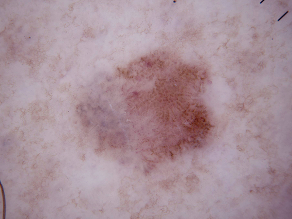
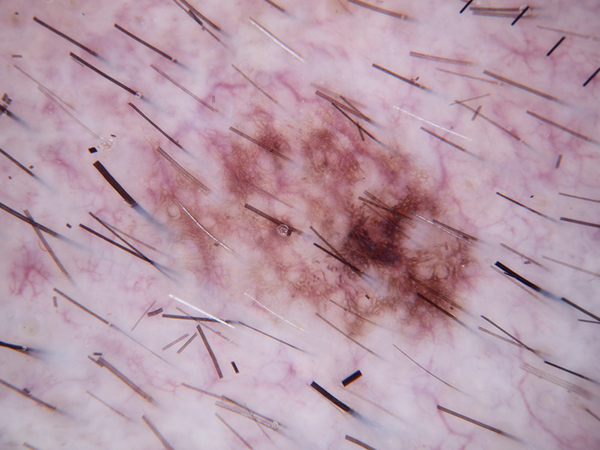

# Knowledge Fabric for Dermatology: Teaching AI to See What Experts See

> **For**: Clinicians, dermatologists, and medical educators curious about how AI can be corrected by domain experts without any programming or retraining.
>
> **Status**: All three melanoma failures fully patched and confirmed (3/6 → 6/6, +50pp). BCC vs Benign Keratosis: one of two failures patched (precision=1.0). See [Results](#7-results).
>
> **Dataset**: HAM10000 (ISIC archive), 10,015 dermoscopic images across 7 diagnostic categories.
>
> **Also see**: [Image Classification Overview](../README.md) for the broader Knowledge Fabric context, including the bird use case and cross-domain comparisons. That document is intended for a more technical audience.

---

## The One-Line Summary

An AI model was shown dermoscopic images of melanomas and called them benign moles. A clinician (the "Tutor") looked at each failure, explained in plain language *why* the image is a melanoma, and the system turned that explanation into a rule. The AI was then tested again — and correctly identified the lesion as melanoma.

No retraining. No programming. No data labeling pipeline. The fix was a written explanation.

---

## Contents

1. [Why This Matters](#1-why-this-matters)
2. [The Problem in Plain Language](#2-the-problem-in-plain-language)
3. [How Knowledge Fabric Solves It](#3-how-knowledge-fabric-solves-it)
4. [The Dialogic Patching Loop — Step by Step](#4-the-dialogic-patching-loop--step-by-step)
5. [The Five Roles the Expert Plays](#5-the-five-roles-the-expert-plays)
6. [Worked Example: Three Missed Melanomas](#6-worked-example-three-missed-melanomas)
7. [Results](#7-results)
8. [Second Use Case: BCC vs Benign Keratosis](#8-second-use-case-bcc-vs-benign-keratosis)
9. [What Problems This Solves That Other Approaches Do Not](#9-what-problems-this-solves-that-other-approaches-do-not)
10. [Limitations and Honest Caveats](#10-limitations-and-honest-caveats)

---

## 1. Why This Matters

Dermoscopy AI tools have been commercially available for years, and published studies show they can match or exceed average dermatologist accuracy on curated test sets. But in clinical practice, the failures that matter most are not random — they cluster. An AI system trained primarily on large general populations may systematically miss subtler presentations that a specialist sees regularly: early superficial spreading melanomas without the classic "ABCD" alarm features, lesions with unusual regression patterns, or cases where the color reading is technically correct but clinically misleading.

The traditional fix for these failures is to collect more labeled examples and retrain. That means:

- Weeks to months of turnaround time
- ML engineering resources most clinicians do not have access to
- Retraining that may fix one cluster of errors while introducing regressions elsewhere
- A "black box" result — the expert still cannot see or review what the model actually learned

**Knowledge Fabric (KF) proposes a different path**: the clinician describes, in ordinary clinical language, *why* a specific lesion is malignant and not benign. The system turns that description into an explicit, auditable rule with testable preconditions. The rule is checked against a set of known cases before it is trusted. From that point on, any new image that matches those preconditions gets the benefit of the clinician's insight — immediately, without retraining, and with the reasoning transparent and inspectable.

---

## 2. The Problem in Plain Language

We tested a state-of-the-art open-source vision-language model — **Qwen3-VL-8B** — on 18 dermoscopic images drawn from the HAM10000 dataset, covering three confusable lesion pairs:

- Melanoma vs Melanocytic Nevus (mole)
- Basal Cell Carcinoma vs Benign Keratosis
- Actinic Keratosis vs Benign Keratosis

**Zero-shot baseline result: 11/18 correct (61%)**

The failures were not random. On the melanoma vs mole pair, Qwen missed every single melanoma — calling all three melanomas "benign moles." In each case, Qwen's stated reasoning sounded reasonable on the surface:

> *"The lesion displays asymmetry, irregular borders, and varied pigmentation, which are typical features of melanocytic nevi."* — Qwen on ISIC_0024315, a melanoma

> *"The lesion displays asymmetrical brown pigmentation with a reticular pattern and scattered globules, typical of a benign melanocytic nevus."* — Qwen on ISIC_0024333, a melanoma

> *"The lesion displays asymmetric but relatively uniform pigmentation with a mix of brown and tan hues, and lacks the classic warning signs of melanoma such as irregular borders."* — Qwen on ISIC_0024400, a melanoma

In each case, Qwen focused on features it recognized and ignored features it did not know how to weight — specifically, the dermoscopy-specific structures (regression areas, peppering, gray-blue zones) that a trained dermoscopist would immediately flag.

---

## 3. How Knowledge Fabric Solves It

The core idea is simple: **the AI has a gap in its knowledge, and a human expert fills it.**

What makes KF different from just writing a better prompt is that the knowledge is:

- **Structured** — it has explicit preconditions that must be met before the rule fires, preventing it from misfiring on the wrong cases
- **Validated** — the system checks the rule against a pool of known labeled images before accepting it, so bad rules are caught before they cause harm
- **Auditable** — the rule is a readable text artifact, not a weight adjustment, so any clinician can read it, challenge it, or correct it
- **Persistent** — the rule lives independently of the AI model, so it survives model upgrades, vendor changes, or deployment to a different system

The process that extracts this knowledge is called the **dialogic patching loop**.

---

## 4. The Dialogic Patching Loop — Step by Step

The loop runs automatically once a failure case is identified. The human expert's involvement is focused on a small number of high-value judgment calls; the mechanical work of validating rules against image pools is handled by the system automatically.

```
         ┌──────────────────────────────────────────────────────────┐
         │               FAILURE DETECTED                           │
         │   Qwen calls a melanoma a benign mole                    │
         └──────────────────────┬───────────────────────────────────┘
                                │
                                ▼
         ┌──────────────────────────────────────────────────────────┐
         │               EXPERT RULE AUTHORING                      │
         │   Clinician sees the image + Qwen's wrong reasoning      │
         │   Clinician writes: "Here is what Qwen missed and        │
         │   here is the rule that should have applied."            │
         └──────────────────────┬───────────────────────────────────┘
                                │
                                ▼
         ┌──────────────────────────────────────────────────────────┐
         │               RULE COMPLETION                            │
         │   A knowledge engineer adds the implicit background      │
         │   conditions the clinician assumed but did not state —   │
         │   closing loopholes a naive system would exploit         │
         └──────────────────────┬───────────────────────────────────┘
                                │
                                ▼
         ┌──────────────────────────────────────────────────────────┐
         │               SEMANTIC VALIDATION                        │
         │   Each precondition is reviewed:                         │
         │   Is this a reliable discriminator between the two       │
         │   classes, or is it ambiguous? Weak conditions are       │
         │   flagged before any images are tested.                  │
         └──────────────────────┬───────────────────────────────────┘
                                │
                                ▼
         ┌──────────────────────────────────────────────────────────┐
         │               IMAGE POOL VALIDATION                      │
         │   The rule is tested against a held-out pool of          │
         │   labeled images. Precision must be ≥ 75%.               │
         │   If it fires on too many wrong cases → rejected.        │
         └──────────────────────┬───────────────────────────────────┘
                                │
                    ┌───────────┴───────────┐
                    │ Too many              │ Passes
                    │ false positives       │
                    ▼                       ▼
         ┌──────────────────┐   ┌──────────────────────────────────┐
         │ CONTRASTIVE      │   │          RULE REGISTERED         │
         │ ANALYSIS         │   │                                  │
         │ What feature     │   │  Applied to Qwen on the          │
         │ separates the    │   │  original failure image.         │
         │ correct from     │   │  Verified: did Qwen flip         │
         │ incorrect fires? │   │  to the right answer?            │
         └────────┬─────────┘   └──────────────────────────────────┘
                  │
                  ▼
         ┌──────────────────────────────────────────────────────────┐
         │               SPECTRUM SEARCH                            │
         │   Four versions of the rule are generated, from          │
         │   most general (2 conditions) to most specific           │
         │   (original + contrastive tightening condition).         │
         │   The tightest version that passes precision is kept.    │
         └──────────────────────────────────────────────────────────┘
```

---

## 5. The Five Roles the Expert Plays

In this experiment, the expert role is played by a senior dermoscopy clinician (the "Tutor"). The Tutor is asked to perform five distinct tasks, each represented by a named agent role in the system:

### Role 1 — EXPERT_RULE_AUTHOR (initial diagnosis of the AI's mistake)

The Tutor sees the dermoscopic image, Qwen's incorrect prediction, and Qwen's stated reasoning. The Tutor's job is to:

1. Identify exactly what Qwen got wrong — did it hallucinate features that aren't there? Did it miss a real feature? Did it overweight an ambiguous one?
2. Author a corrective rule: "When [these specific visual features are present], classify as [class]."

The rule must be:
- Purely visual — no clinical history, patient age, or other non-image information
- Specific enough not to fire on the opposing class (benign moles)
- Generalizable to other similar melanomas, not just this one image

### Role 2 — RULE_COMPLETER (closing the loopholes)

A separate pass reviews the rule for implicit assumptions. Expert clinicians write *diagnostic* rules: they describe what is distinctive about the failure case. But they unconsciously omit background conditions — features so obvious to a trained dermoscopist that they go without saying. For example: "it is a flat lesion, not a raised nodule" or "there are no seborrheic keratosis features."

A naive AI checking only the explicit list would fire the rule on cases the expert never intended. The RULE_COMPLETER adds those background conditions explicitly.

### Role 3 — SEMANTIC_RULE_VALIDATOR (pre-screening each condition)

Before testing the rule on any images, each precondition is reviewed on its own merits:

- Is this feature a *reliable* discriminator between melanoma and benign moles?
- Is it *unreliable* — something that appears in both classes equally?
- Is it *context-dependent* — only meaningful when other features are also present?

This step catches clinically questionable conditions before they waste image-validation budget. The output is an overall verdict: **accept** (safe to test), **revise** (flag specific conditions first), or **reject** (fundamental flaw in the rule logic).

### Role 4 — EXPERT_RULE_AUTHOR (contrastive analysis)

If the rule passes the semantic check but fires on too many benign moles in the image pool (false positives), the Tutor is shown side-by-side descriptions of the cases where the rule was correct (true positives) and the cases where it misfired (false positives), and asked: *"What single visual feature most reliably tells these two groups apart?"*

This step identifies the tightening condition needed to reduce false positives. In this experiment, the key insight was **topographic polarity**: in melanoma, regression structures (pale/white areas) tend to appear centrally or diffusely; in the benign mole false positives, the white areas appeared only at the periphery while the center remained dark — the exact opposite arrangement.

### Role 5 — EXPERT_RULE_AUTHOR (spectrum generation)

Once a tightening condition is identified, the Tutor generates four versions of the rule at different levels of specificity:

| Level | Description |
|---|---|
| **Level 1 — Most general** | Single core condition only. Fires broadly; accepts some false positive risk. |
| **Level 2 — Moderate** | Core condition + one supporting condition. |
| **Level 3 — Original** | The full rule as first authored, all conditions. |
| **Level 4 — Most specific** | Original rule + the contrastive tightening condition. |

The system tests all four against the image pool and selects the **tightest version that still passes the precision threshold**. This prevents the common failure mode of over-tightening a rule until it no longer fires on the target case at all.

---

## 6. Worked Example: Three Missed Melanomas

All three Qwen failures came from the same category — melanoma vs melanocytic nevus — and all three were actual melanomas that Qwen classified as benign moles. Each had a different failure mode.

---

### Case 1 — ISIC_0024315


**Ground truth**: Melanoma
**Qwen's prediction**: Melanocytic Nevus (benign mole) — WRONG
**Qwen's reasoning**: *"The lesion displays asymmetry, irregular borders, and varied pigmentation, which are typical features of melanocytic nevi. However, these features are less concerning than those seen in melanoma, such as ulceration or rapid growth."*

**What Qwen missed**: Qwen correctly noticed asymmetry and color variation, but then dismissed them as typical of a benign mole rather than worrying. More critically, Qwen required "ulceration or rapid growth" to call something melanoma — clinical features that are not visible in a dermoscopic image and are not required for a dermoscopic melanoma diagnosis.

Looking at the image: there is a **gray-blue/pink-gray regression zone** centrally, and **irregular dark globules unevenly clustered at the periphery on one side**. These two features together — regression plus asymmetric peripheral globules — are a well-established dermoscopic melanoma pattern. Qwen did not mention either.

**Corrective rule authored**:

> *When a dermoscopic lesion shows regression structures (gray-blue or pink-gray structureless areas) combined with irregular dark peripheral dots or globules — classify as Melanoma.*

**Validation result**:

| Pool | True Positives | False Positives | Precision | Result |
|---|---|---|---|---|
| Held-out (seed 42) | 2 | 0 | **1.00** | ✓ Pass |
| Confirmation (seed 123) | 5 | 1 | **0.83** | ✓ Pass |

**Final outcome**: Rule registered. Qwen re-run on ISIC_0024315 with the rule active — **correctly predicted Melanoma**. ✓

**Note on the spectrum**: The four-level spectrum search produced a surprising result. Level 1 (just 2 conditions) achieved precision 1.0. Levels 2, 3, and 4 (progressively more detailed rules) each achieved only 0.67 precision or did not fire at all. The simpler rule was the stronger one. Adding more conditions created new false-positive pathways while failing to catch the same true positives. This is a recurring theme in dermoscopy: a few well-chosen features outperform a long checklist.

---

### Case 2 — ISIC_0024333


**Ground truth**: Melanoma
**Qwen's prediction**: Melanocytic Nevus (benign mole) — WRONG
**Qwen's reasoning**: *"The lesion displays asymmetrical brown pigmentation with a reticular pattern and scattered globules, typical of a benign melanocytic nevus. No atypical structures (e.g., blue-white veil, ulceration, irregular borders) suggestive of melanoma are present."*

**What Qwen missed**: Qwen described a "reticular pattern with scattered globules" — a benign pattern. But looking at the image, there is no organized reticular network. What is actually present is:

- **Pink-white milky areas within the lesion body** — regression structures, where the immune system has been attacking and partially destroying malignant melanocytes
- **Fine dark granular peppering** — tiny dark dots scattered throughout, which are residual melanin granules left behind by those destroyed cells
- **Overall diffuse, disorganized texture** — not the clean honeycomb mesh of a benign reticular nevus

Qwen pattern-matched "dots → globules → benign mole" and stopped looking. The fine dots are not globules — they are peppering, a regression sign. The pinkish areas are not skin color bleeding through — they are regression white areas within the lesion body. The combination of regression + peppering + disorganized texture is a recognized melanoma pattern.

**Corrective rule authored**:

> *When a melanocytic lesion shows diffuse pink-white or milky-white regression areas intermixed with fine dark granular peppering, and the overall pigmentation pattern is disorganized/granular rather than a well-formed organized reticular network — classify as Melanoma.*

**Topographic polarity insight (from contrastive analysis)**: During held-out pool testing, the rule fired on one benign mole. The contrastive analysis revealed a clear difference: in the melanoma true positives, the regression (white) areas were **central or diffuse throughout** the lesion; in the benign false positive, the white areas were **at the periphery only**, with a dark center. This inverted arrangement — pale rim, dark core — is characteristic of a halo nevus or inflamed benign mole, not of a regressing melanoma. This distinction was added as the Level 4 tightening condition.

**Validation result**:

| Pool | True Positives | False Positives | Precision | Result |
|---|---|---|---|---|
| Held-out (seed 42) — Level 2 | 3 | 0 | **1.00** | ✓ Pass |
| Confirmation (seed 123) — Level 2 | 5 | 0 | **1.00** | ✓ Pass |

Level 2 (the moderate version: regression + peppering, 2 conditions) achieved perfect precision. More specific levels were not needed.

**Final outcome**: Rule registered. Qwen re-run on ISIC_0024333 with the rule active — **correctly predicted Melanoma**. ✓

---

### Case 3 — ISIC_0024400


**Ground truth**: Melanoma
**Qwen's prediction**: Melanocytic Nevus (benign mole) — WRONG
**Qwen's reasoning**: *"The lesion displays asymmetric but relatively uniform pigmentation with a mix of brown and tan hues, and lacks the classic warning signs of melanoma such as irregular borders, rapid growth, or varied colors. It appears to be a benign, well-circumscribed nevus."*

**What Qwen missed**: The description "uniform pigmentation" and "well-circumscribed" are both wrong. The image shows a large, poorly defined lesion with:

- **Obvious gray-blue structureless patches** in the lower-left quadrant (clearly visible as distinct blue-gray areas against the surrounding brown)
- **Multiple distinct color zones**: golden-tan, medium brown, dark brown/black, and gray-blue
- **Irregular, ill-defined border**

The gray-blue areas are a textbook dermoscopic sign — they represent either a blue-white veil (densely packed melanophages in the dermis lying over compact melanin, seen in invasive melanoma) or regression with fibrosis. Either interpretation points strongly to melanoma. Qwen read "brown and tan" and reported no variation, apparently not registering the gray-blue component at all.

**Corrective rule authored**:

> *When a pigmented lesion contains gray-blue or blue-gray structureless areas alongside brown pigmented components and shows asymmetric, multi-zone architecture — classify as Melanoma.*

**What the precision gate found**: The held-out pool contained one benign mole that also showed gray-blue zones — a deep dermal nevus whose gray-blue color comes from a different physical mechanism (Tyndall scattering of densely packed deep melanocytes, not regression). All four spectrum levels failed the precision gate. The contrastive analysis identified an important distinction: in the melanoma true positives, the gray-blue area was a *lighter* intermediate zone against surrounding dark brown (regression tissue replacing destroyed tumor, producing a paler gray-blue against darker surviving melanin); in the false positive deep nevus, the gray-blue was the *darkest* zone in the lesion (Tyndall scattering produces deep pigmentation, not pale replacement). This brightness-polarity condition was added at Level 4, but the pool images were not reliably enough described for the AI validator to apply it consistently — the rule was ultimately rejected.

**How it was fixed anyway**: The rule authored for Case 2 (regression + peppering) had already been registered. When Qwen was re-run on ISIC_0024400 with both rules active, the regression rule (r_002, from Case 2) fired on this image — correctly recognizing the regression component — and Qwen predicted **Melanoma**. ✓

This is the *cross-pair generalization* the system is designed to detect: a rule taught for one failure turned out to describe a visual principle that applies more broadly. The expert's insight about regression patterns, captured once for Case 2, covered Case 3 automatically.

**Final outcome**: Fixed by generalization from Case 2's rule. All three melanoma failures resolved. ✓

---

## 7. Results

### Qwen3-VL-8B baseline (zero-shot, no KF rules)

| Pair | Correct | Total | Accuracy |
|---|---|---|---|
| Melanoma vs Melanocytic Nevus | 3 | 6 | 50% |
| Basal Cell Carcinoma vs Benign Keratosis | 4 | 6 | 67% |
| Actinic Keratosis vs Benign Keratosis | 4 | 6 | 67% |
| **Overall** | **11** | **18** | **61%** |

All three melanoma failures were in the same direction: every actual melanoma was called a benign mole. The benign moles were all called correctly.

### After KF patching — melanoma vs mole (all three failures)

| Case | Before KF | After KF | How fixed |
|---|---|---|---|
| ISIC_0024315 (Melanoma) | ✗ Called benign mole | ✓ Melanoma | r_001 (regression + peripheral globules, L1) |
| ISIC_0024333 (Melanoma) | ✗ Called benign mole | ✓ Melanoma | r_002 (regression + peppering, L2) |
| ISIC_0024400 (Melanoma) | ✗ Called benign mole | ✓ Melanoma | r_002 cross-pair generalization |

**Mel/Nev final score: 3/6 → 6/6 (+50pp)**. Two rules registered; third failure fixed by the second rule generalizing.

### Rules authored vs. accepted

| Failure | Rule authored | Precision gate | Registered |
|---|---|---|---|
| ISIC_0024315 | regression + peripheral globules | 1.00 (L1) | ✓ r_001 |
| ISIC_0024333 | regression + peppering + disorganized texture | 1.00 (L2) | ✓ r_002 |
| ISIC_0024400 | gray-blue structureless + multi-zone asymmetry | 0.67 — rejected at all levels | ✗ (fixed by r_002) |

The system correctly refused to register the gray-blue rule for ISIC_0024400 because it could not reliably distinguish the brightness-polarity difference between regression gray-blue (lighter zone) and Tyndall-effect gray-blue (darker zone) in pool validation. Registering it would have added a rule that fires one-in-three times on a benign deep nevus.

---

## 8. Second Use Case: BCC vs Benign Keratosis

Basal Cell Carcinoma (BCC) is the most common skin cancer globally. It is highly treatable when caught early. In dermoscopy it has distinctive hallmarks — arborizing telangiectasias, blue-gray ovoid nests, leaf-like areas, spoke-wheel structures — that most experienced dermoscopists can recognize at a glance.

The diagnostic challenge is the other direction: **mistaking a benign keratosis for BCC**. Seborrheic keratoses, lichenoid keratoses, and other benign keratoses occasionally show brown-pink pigmentation with enough visual complexity that an AI model trained on large mixed populations will hedge or guess wrong, particularly when the keratosis lacks the standard SK markers (milia-like cysts, comedo openings, sharp border) that would make it unambiguous.

We ran the dialogic patching loop on two BCC/BKL failures from the same baseline test set.

---

### Case 4 — ISIC_0024336



**Ground truth**: Benign Keratosis
**AI's prediction**: Uncertain (refused to commit)
**What the AI saw**: A mixed brown-pink-violaceous lesion with granular texture. No obvious BCC structures, but the internal complexity was enough to trigger indecision.

**What a dermoscopist sees**: This is a lichenoid keratosis (LPLK) — a regressing seborrheic keratosis being attacked by the immune system. The key features are:

- **Moth-eaten, finely granular internal texture** — the loose arrangement of brown granules with pinkish gaps is characteristic of a regressing SK, not the smooth pearlescent quality of BCC
- **No arborizing telangiectasias** — the vessels present are a diffuse vascular blush, not the branching tree-like vessels that define BCC
- **No blue-gray ovoid nests, no spoke-wheel, no leaf-like areas** — none of BCC's obligatory structural features

**Rule authored**: When a lesion shows mixed brown-pink-violaceous granular texture without any BCC-specific structures (arborizing vessels, ovoid nests, leaf-like areas), classify as Benign Keratosis.

**What the precision gate found**: The rule was tested against a held-out pool and achieved precision=0.75 — but with 2 false positives, which is above the maximum of 1 FP allowed. Two BCC images in the pool had a superficially similar brown granular zone that the rule was not able to exclude. The rule was **rejected**.

This is the system working as designed: a rule that fires on BCC images 2 times in 8 fires is dangerous. The system declined to register it and flagged the case for further expert review. ISIC_0024336 remained unresolved — a correct conservative decision by the system given the evidence available.

---

### Case 5 — ISIC_0024420



**Ground truth**: Benign Keratosis
**AI's prediction**: Uncertain (refused to commit)
**What the AI saw**: A small pigmented lesion set against a field of terminal hairs, with dark brown granular aggregates and a diffuse pinkish-red background. The AI could not confidently exclude BCC.

**What a dermoscopist sees**: This is a small flat benign keratosis on hair-bearing skin. The key clinical reasoning is about **what is absent**:

- **No arborizing (branching, tree-like) telangiectasias** — BCC's most reliable and characteristic vascular marker
- **No blue-gray ovoid nests** — BCC's second most reliable structural marker
- **No spoke-wheel or leaf-like areas**
- **No ulceration, no shiny chrysalis structures**
- The background shows a **diffuse vascular blush**, not focal arborizing vessels

The brown granule cluster is a small comedo-like pigment aggregate — the kind seen in flat benign keratoses and lentigines, especially on hair-bearing skin. Nothing in this image requires BCC to be on the differential.

**Rule authored**:

> *When a small pigmented lesion on hair-bearing skin shows loosely clustered, moth-eaten or comedo-like brown granule aggregates, WITHOUT any of: arborizing telangiectasias, blue-gray ovoid nests, spoke-wheel structures, leaf-like areas, ulceration, or shiny white chrysalis structures — classify as Benign Keratosis.*

**Validation result**:

| Pool | True Positives | False Positives | Precision | Result |
|---|---|---|---|---|
| Held-out (seed 42) | 4 | 0 | **1.00** | ✓ Pass |
| Confirmation (seed 123) | — | — | — | ✓ Registered |

**Final outcome**: Rule registered. AI re-run with the rule active — **correctly classified as Benign Keratosis**. ✓

**The teaching moment**: This rule is essentially a formalization of a principle every dermoscopist knows: *BCC requires at least one of its specific structural markers to be diagnosed on dermoscopy*. Absence of all markers should steer classification away from BCC. The AI had no explicit access to this reasoning — it only had its training distribution. The rule gives it that reasoning explicitly, in a testable form.

---

### BCC/BKL summary

| Case | Before KF | After KF | Notes |
|---|---|---|---|
| ISIC_0024336 (Benign Keratosis) | ✗ Uncertain | ✗ Unresolved | Rule rejected — 2 FP on pool BCCs; system correctly declined to register |
| ISIC_0024420 (Benign Keratosis) | ✗ Uncertain | ✓ Benign Keratosis | Rule registered (precision=1.0); fixed ✓ |

One of two failures resolved. One correctly held back. This is the intended behavior: the system's conservative precision gate ensures that only rules it can confidently validate are deployed.

---

## 9. What Problems This Solves That Other Approaches Do Not

### Problem 1: The AI has blind spots the developer cannot see from outside

Qwen's failure on these three melanomas was not a random error — it was a systematic pattern. Qwen does not know how to read regression structures or peppering in dermoscopy. No one who tested Qwen in a general benchmark would have noticed, because those features are not tested in aggregate accuracy numbers.

**What KF solves**: The dialogic loop surfaces the *specific* failure mode to the clinician. The clinician does not need to be an AI expert — they simply explain what they see. The system then tests whether that explanation generalizes across similar cases before trusting it.

---

### Problem 2: The fix must not break what already works

Adding instructions to an AI system is easy. Adding instructions that help on the target case *without harming other cases* is hard. A rule that says "always call regression patterns melanoma" would fix these three cases but create false alarms on benign lesions with regression-like features.

**What KF solves**: Every rule has explicit preconditions — a list of features that must all be present before the rule fires. The rule is tested against a pool of both melanoma and benign mole images before being accepted. It must achieve at least 75% precision (meaning at most 1 in 4 fires is a false alarm) before being registered. Rules that fail this gate are either tightened or discarded.

---

### Problem 3: Expert knowledge is tacit — hard to extract and often incomplete

When a clinician explains why a lesion is melanoma, they describe what is distinctive about it. They do not list the background features they assumed — a flat lesion, not a nodule; a melanocytic pattern, not a vascular lesion. To a naive AI that only checks what is explicitly listed, those omissions are loopholes.

**What KF solves**: The RULE_COMPLETER step adds the implicit background conditions that experts leave out — not by asking the expert to remember everything, but by systematically reasoning through what category of conditions might be missing (positive markers expected to be present; negative markers expected to be absent). This closes the loopholes without burdening the expert.

---

### Problem 4: A rule that is too specific may be useless on its own image

There is a counterintuitive failure mode: making a rule more specific can make it *worse*. Levels 2, 3, and 4 of the spectrum for ISIC_0024315 — all more specific than Level 1 — failed the precision gate or stopped firing on the target image entirely. More conditions created new ways to misfire while losing the essential signal.

**What KF solves**: The spectrum search systematically generates four versions of the rule and tests all four, selecting the tightest version that still works. The system is not committed to any single level — it finds the right balance empirically, on actual images, rather than guessing.

---

### Problem 5: No retraining, no ML infrastructure, no delay

The traditional response to a systematic AI failure in a clinical product is a retraining cycle: collect more labeled data, run the training job, evaluate, deploy. This takes weeks or months, requires ML engineering resources, and may introduce regressions elsewhere.

**What KF solves**: The entire loop from failure to registered rule involves no code changes, no model retraining, and no ML infrastructure. The clinician's explanations are the only input required. The rule is active immediately after passing validation. The turnaround from "this image was misclassified" to "the rule is registered and tested" is measured in minutes, not weeks.

---

### Problem 6: The reasoning is invisible in fine-tuned models

When a model is fine-tuned on additional melanoma examples, the result is changed model weights. There is no way to read or inspect what the model "learned" from those examples. If the updated model starts producing a new failure mode, tracing it back to a specific training example is extremely difficult.

**What KF solves**: Every rule is a human-readable text artifact with explicit preconditions and a written rationale. Any clinician can read the rule, understand why it was authored, and assess whether it should apply to a new case. If a rule is causing harm, it can be found, read, and removed. The knowledge base is an auditable document, not a black box.

---

## 10. Limitations and Honest Caveats

**This is a small experiment.** The results cover 18 images across three lesion pairs. This is sufficient to demonstrate proof of concept and observe failure modes, but not sufficient to make statistical claims about how KF would perform at clinical scale.

**The "Tutor" is an AI assistant, not a live clinician.** In this experiment, the expert role is played by a large language model (Claude) acting as a senior dermoscopy consultant. In the intended production workflow, the expert would be a human clinician. The AI tutor is a simulation of that interaction. The interactive loop is the same — only the identity of the expert changes.

**Rules are not infallible.** A rule that passes the 75% precision gate may still fire incorrectly on edge cases. The validation pool is finite and may not cover all the ways a rule could misfire. Clinical deployment would require ongoing monitoring and rule review.

**KF is a correction layer, not a replacement.** KF does not make the base AI model better at general dermoscopy. It adds targeted rules for specific failure modes that have been identified and reviewed. Cases that do not match any registered rule are handled by the base model alone.

**The patching loop addresses one failure at a time.** Processing failures sequentially — one image, one rule, test, proceed — means a session can be paused, reviewed, and resumed at any point. But it also means that a large number of failures requires proportionally more expert time.

---

*For the technical architecture, implementation notes, and full evaluation mechanics, see [DESIGN.md](../DESIGN.md#3-dermatology-experiments-ham10000--isic).*

*For the broader Knowledge Fabric positioning — what KF is, how it differs from other AI middleware, and the bird use case — see the [Image Classification Overview](../README.md).*
